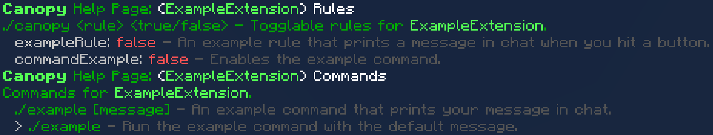

<div align="center">
    <a href="./pack_icon.png">
        
    </a>
    <p><b>Canopy Extension Example</b></p>

[](https://app.codacy.com/gh/ForestOfLight/Canopy-Extension-Example/dashboard?utm_source=gh&utm_medium=referral&utm_content=&utm_campaign=Badge_grade)
[-brightgreen)](https://feedback.minecraft.net/hc/en-us/sections/360001186971-Release-Changelogs)
[](LICENSE)
[](https://discord.gg/9KGche8fxm)
</div>

---

Extensions?! In a behavior pack?! Yep! This repo contains an example pack designed to teach you how to create your own extensions for **Canopy**. All extensions must be added to the same world as **Canopy** (the dependencies in the `manifest.json` should ensure that).

## How this example pack functions ingame

What **Canopy** handles:

**`./canopy <rule> [true/false]`**  
**Canopy** will automatically include the names of your rules in the `./canopy` command.

**`./help`**  
**Canopy** will automatically include a Rules and a Commands help page for your extension.



What the extension handles:

**`./example [message]`**  
This command sends a message to the chat. It also has a default message if no message is provided. (Alias: `./ex`)

**`commandExample`**  
This rule will enable the `./example` command.

**`exampleRule`**  
This rule will enable a message in chat when you push a button.

## How to create an extension

1. Clone this repo.   
    ```sh
    git clone https://github.com/ForestOfLight/canopy-extension-example.git
    ```
2. Remove all files that are not the `pack_icon.png`, the `manifest.json` file, or in the `scripts/` folder.
3. Rename the folder to your extension's name.   
    ```sh
    mv canopy-extension-example your-extension-name
    ```
4. Open the folder in your favorite code editor.
5. Edit the `manifest.json` file to match your extension's information.
6. Replace the `pack_icon.png` with your extension's icon.
7. Edit the `main.js` file to add your extension's functionality.

> [!TIP]
> Most information about how to code a **Canopy Extension** can be found in the `main.js` file.

## How to use an extension

1. Add the extension pack to the same world as the **Canopy** RP & BP.
2. Profit.

**Canopy** will automatically detect the extension and load it!

## How does this work?

**Canopy** and its extensions all communicate using scriptevents! The vanilla `/scriptevent` command allows for sending strings to Behavior Packs and the `ScriptEventCommandMessage` event allows for recieving them. **Canopy** uses [MCBE-IPC](https://https://github.com/OmniacDev/MCBE-IPC), a library that streamlines the process of sending and recieving scriptevents.  
**Canopy Extensions** use these to communicate with **Canopy** when new rules and commands are added. **Canopy** uses these as well to get rule data, set rule data, and call command callbacks from extensions.  

## Issues & Suggestions

If you have any issues or suggestions, please open an issue on this repo. Additionally, if you're interested in contributing to the project, feel free to open a pull request! 
